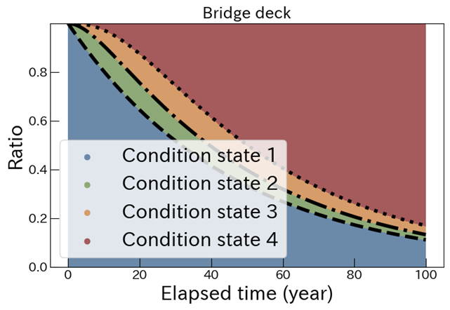
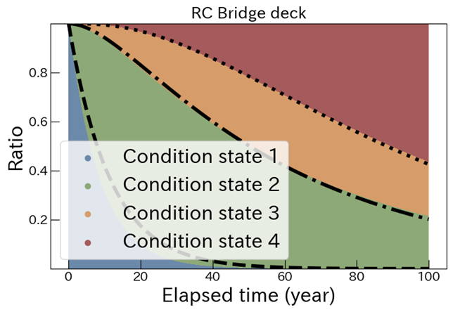

CTMC × DeepSets による推移率推定（Transition Rate Estimation）

概要
- 連続時間マルコフ連鎖（CTMC: Continuous-Time Markov Chains）における推移率行列 Q（あるいはその要素）を、観測された遷移データの集合から深層学習（DeepSets）で直接推定するリポジトリです。
- 入力は「状態対（pre_state, post_state）と経過時間 Δt の可変長集合」、出力は「正の推定パラメータ（例: 4状態直鎖モデルの隣接遷移率）」です。
- 尤度最大化などの反復最適化を関数近似で置き換えることで、推定の即時化・自動化を目指します。

提案フレームワーク


背景と目的
- CTMCのパラメータ推定は、一般に非凸最適化・初期値依存・反復計算のコストといった実務上の障壁があります。
- 本リポジトリでは、観測集合 X からパラメータ空間 Q への写像 f: X → Q をニューラルネットワーク（DeepSets）で学習し、従来の最尤推定過程をサロゲートすることで「1ステップの近似写像評価」に置き換えます。
- 可変長かつ順序不変（集合）な入力を扱える点がDeepSetsの利点であり、実データ（下水道管・RC橋・床版）や合成データで評価します。

主な構成物
- models/model_0929.py: DeepSetsモデル実装（埋め込み、トークンMLP、注意プーリング、出力MLP）＋Dataset/Collate
- notebooks/notebook_for_real_data.ipynb: 実データでの検証・可視化
- notebooks/notebook_for_synthetic_data.ipynb: 合成データ生成〜学習・評価の流れ
- notebooks/evaluate_mixed_model.py: 学習済み重みを用いた一括推論スクリプト
- utils/data_generator.py: 合成データ生成およびCTMC遷移確率の計算（解析式）
- utils/formate_matrix_toMLData.py: 行列のトリミングとベクトル化ユーティリティ
- utils/likelihood.py: 従来の最適化ベース推定（L-BFGS-B）
- real_data/*.csv: 実データ例（pre_state, post_state, delta_t の三列）
- model_weights/mixed_distribution/mixed_0929.pth: 学習済みモデル重み
- figs/readme/*.png, figs/result/*.png: 図表（枠組み、数式、結果）

インストール
- 推奨: Python 3.11+
- 主要パッケージ（例）
  - torch, numpy, scipy, pandas, matplotlib, scikit-optimize, scikit-learn, jupyter
- 例（CPU環境）
  ```bash
  pip install torch numpy scipy pandas matplotlib scikit-optimize scikit-learn jupyter
  ```

データ形式
- 基本の観測データは 3 列（CSV/TXT）:
  - pre_state, post_state, delta_t
  - 例: real_data/RCBridge.csv
- 状態インデックスは 1-based（1,2,3,…）。0 は内部PADとして使用される想定です。


モデル（models/model_0929.py）
- 入力
  - state: (B, 2, L) の LongTensor（pre/post状態インデックス）
  - delta_t: (B, L) の FloatTensor（各遷移の経過時間）
  - lengths: (B,) の LongTensor（各系列の有効長）
  - input_is_one_based=True を想定（PAD=0）。
- 出力
  - (B, 3) の正値パラメータ（softplus）。4状態直鎖（最後吸収）モデルの隣接遷移率に対応。
- 集合処理
  - トークン特徴（埋め込み＋Δt）→トークンMLP→注意プーリング→出力MLP。


- オプション
  - --device {auto,cuda,mps,cpu}: 利用デバイス選択（autoはCUDA>MPS>CPUの順に選択）

ノートブック
- notebooks/notebook_for_real_data.ipynb: 実データの前処理・推論・可視化の手順
- notebooks/notebook_for_synthetic_data.ipynb: 合成データの評価の一連の流れ

実験結果（例）
- 
- 
- 

既知の注意点
- 合成データ（synthetic data）は本リポジトリには含まれていません。必要に応じて `utils/data_generator.py`で生成してください。
- 状態は 1-based 前提（0 はPAD）。フォーマットが異なる場合は前処理で合わせてください。
- 一部スクリプトは「Q行列＋観測データの合成行列」を想定する箇所があります。
- 重みファイルは models/model_0929.py と互換のバージョンを使用してください。

関連資料
- simple_thesis.md に数式や背景の詳細な説明があります。
- Deep Sets: Zaheer et al., NeurIPS 2017
- CTMC に関する基礎文献（教科書等）
