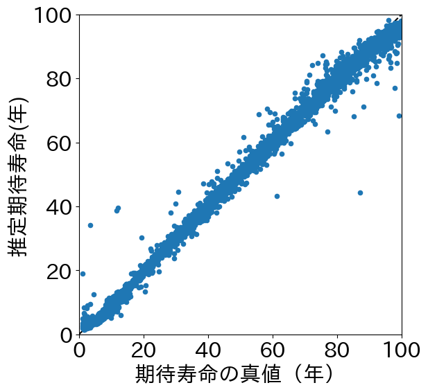

# 概要・目的
連続時間マルコフ連鎖（CTMC: Continuous-time Markov Chains）は，状態間の遷移が確率的かつ連続時間で発生する動的システムを表現するための基本的な枠組みである．特に，状態が時間とともに不可逆的に劣化するような現象（例：社会インフラの劣化，金融商品の信用格付け変化）において，CTMCは自然かつ数理的に妥当なモデルとして広く採用されている.

本リポジトリでは，CTMCの仮定の下での観測データ集合（状態遷移と経過時間のタプル）を入力とし，推移率行列（Transition rate matrix）に含まれるパラメータを直接出力する深層学習モデルを構築する．従来，これらのパラメータは尤度関数の最大化を通じて，逐次的かつ最適化的な反復計算アルゴリズムで推定されていた．しかし，これらの計算プロセスは非凸性や，初期値依存性，アルゴリズムの複雑さなどの困難を含んでいた．

そこで本リポジトリでは，サンプル集合空間を $\mathcal{X}$ ，推移率パラメータ空間を $\mathcal{Q}$ とし，それらを結ぶ写像 $f:\mathcal{X} \to \mathcal{Q}$ をニューラルネットワークにより学習させる．この写像は，最尤推定の過程を関数近似としてサロゲートするものであり，予測モデルとしてCTMC推定を即時化・自動化することが可能となる．

この手法は，従来の推定プロセス全体をブラックボックスな近似関数で置き換え，入力から直接推定結果を得ることができる新しい推定パラダイムの一形態として位置づけられる．

## 提案するフレームワーク

  
統計モデルにおけるパラメータ推定（例：最尤推定，ベイズ推定）は，解析的に解ける場合は稀であり，通常は反復的な数値最適化アルゴリズム（勾配法やEMアルゴリズムなど）を通じて近似的に求められる．この推定プロセスは，一般に非凸性，高次元性，初期値依存性などの計算的困難を伴う．

本リポジトリでは，このような「推定プロセス」自体を，観測データ集合 $\mathcal{X}$ からパラメータ空間 $\mathcal{Q}$ への写像 $f: \mathcal{X} \to \mathcal{Q}$ として再定式化し，これを深層学習モデルによって関数近似するアプローチを提案する．すなわち，推定アルゴリズムを明示的に記述・実装・反復実行するのではなく，あらかじめ学習されたニューラルネットワークを通じて，推定処理を1ステップの写像評価に置き換えることを目指す．

このアプローチは，以下の観点で大きな利点を有する：

推定アルゴリズムのブラックボックス化により，複雑な数式定式化や反復最適化の実装を不要とする．

統計モデルの構造と挙動を含んだ写像 $f$ を学習することで，任意の入力データから即時に推定値を出力できるモデルが構築可能となる．

データ $\mathcal{X}$ と，それに対応するパラメータ $\mathcal{Q}$ のペアが十分に生成可能である限り，CTMCに限らず，任意の統計モデルへの拡張が可能である．

特に，推定アルゴリズムの数理的複雑性が実装や運用の障壁となるような文脈において，本手法は，「推定過程そのものを写像として近似する」ことにより，推定処理を高速・省力化する強力な手法論として位置づけられる．

## CTMCの定式化
### CTMCの定義
CTMCは高々加算無限の状態空間 $\mathcal{S} = \{1,2,3, \cdots\}$ からなる連続状態上の確率過程 $ \{s(v); 0 \leq v \leq t\} $ として定義され．任意の時刻 $t,u \geq 0$ ，任意の状態 $i,j \in \mathcal{S}$ に対して，  

$$
    P(s(t+u) = j | \{s(v), 0 \leq v \leq t \}, s(t) = i) \; = \;
    P(s(t+u) = j | s(t) = i)
$$  

で定式化される**連続時間上でのマルコフ性**が成り立つ確率過程である．  

上式で示したマルコフ性は，「ある時刻$t$で状態 $i$ であった時に別の時刻 $t+u$ で状態 $j$ である確率は，過去の状態の履歴 $\{s(t); s(t) \in \mathcal{S}, t \geq 0\}$ によらず，ただ時刻 $t$ に状態 $i$ であったという事実のみに依存して決定される」ことを意味する．  

また，一般にCTMCは高々加算無限の状態空間に対して定義されるが，深層学習モデルとしての実装の容易さや実用性の観点から**有限状態空間**を仮定する．したがって，以降は有限の状態空間 $\mathcal{S} = \{1,2,3, \cdots N\}$ について考える．  

### 推移率行列 $\boldsymbol{Q}$ の導入
状態間の推移は以下に示す推移率行列 $\boldsymbol{Q}$ によって定められる．  
  
ここで， $q_{i,j}$ は状態$i$から状態 $j$ への単位時間あたりの推移率であり， 微小時間 $\Delta t$ における状態推移の起こりやすさを示している．  
また，対角成分 $-\sum_{i \neq j}q_{i,j}$ の絶対値の逆数が，状態$i$における**期待滞在時間**として解釈され，滞在時間はこの絶対値をパラメータに持つ指数分布に従うことが知られている．   

移率行列 $\boldsymbol{Q}$ は以下の行列指数関数によって，任意の時間経過$t$での推移確率行列 $\boldsymbol{P}(t)$ に変換できる．  
  
この式で $p_{i,j}$ は，「時刻 $t = 0$ で状態 $i$ であったときに，時間 $t$ 経過後に状態 $j$ に遷移している確率」を表す．

### 観測データと尤度関数
本リポジトリでは，CTMCに従う現象に対して，以下の形式の観測データが得られると仮定する：  

$$
    x_k = (i_k, j_k, t_k), \; \boldsymbol{X} = \{x_k | k \in \{1,2, \cdots ,K \} \}
$$

ここで， $i_k$ は以前の観測状態， $j_k$ は次の観測状態， $t_k$ は2つの観測の時間間隔を意味し，これらを合わせて観測データ $\boldsymbol{x}$ とし， $\boldsymbol{x}$ からなる観測データ集合を $\boldsymbol{X}$ ， $K$ は集合 $\boldsymbol{X}$ 要素数（観測データの総数）を表す．  

CTMCの推移率行列 $\boldsymbol{Q}$ 対して，任意の時間間隔 $t$ に対応する推移確率行列 $P$ が行列指数関数によって得られるため，観測データ集合に基づく尤度関数は以下の定式化のように定義される．  

$$
    \mathcal{L}(\boldsymbol{Q}|\boldsymbol{X}) = \prod_{k=1}^K p(t_k)_{i_k,j_k}
$$  

この式において， $p(t_k)_{i_k,j_k}$ は，CTMCの推移率行列 $\boldsymbol{Q}$ から，得られた時間間隔 $t_k$ ごとに算出される推移確率行列 $\boldsymbol{P}(t)$ の $(i_k,j_k)$ 成分にあたる．  
一般にCTMCにおける最尤推定では，この尤度関数を以下の負の対数尤度関数に変換して，最小化問題として反復計算による最適化アルゴリズムを用いてパラメータ推定を行う．  

$$
    \mathcal{L}'(\boldsymbol{Q}|\boldsymbol{X}) = -\sum_{k=1}^K \log(p(t_k)_{i_k,j_k})
$$

### 問題設定
本リポジトリでは，上述したCTMCを社会インフラの統計的劣化モデルとして応用することを考える．  
この時，得られる観測データはそれぞれ以下のように解釈される:
-  $i_k$ ：以前の点検での状態（劣化度）
-  $j_k$ ：次の点検での状態（劣化度）
-  $t_k$ ：二つの点検の間隔（経過時間）

ここで状態（劣化度）は数値が大きいほど状態が悪化していることを示すものとする．  
また，本リポジトリではCTMCの枠組みを社会インフラの統計的劣化モデルとして適用するにあたり，以下の仮定をおく：
- 劣化度は4段階で表される（数値が大きいほど状態悪化）
- 微小時間あたりに進行しうるのは 1 段階の劣化のみ（近接状態へのみ遷移可能）
- 自然回復（劣化度の改善）はしない

この仮定のもとでは，求めるべき推移率行列は以下のような形になる：  
   

これより，求めるべきパラメータは $(q_{1,2},q_{2,3},q_{3,4})$ となる．  
以降では，この問題を最尤推定によって解くプロセスを代理する深層学習モデルのアーキテクチャについて検討を行う．

## モデルのアーキテクチャについて
### Deep Sets
本研究では，点検データ集合$D={(i,j,t)}$のような，要素の順序に意味を持たない集合構造のデータを扱う．そのため，代理モデルのアーキテクチャとして，集合入力に対して順序普遍な写像を構成できるDeepSets（Zaheer et al., 2017）を採用した．DeepSetsは入力集合$X=\{x_1,x_2,⋯x_K \}$に対して，任意の順序不変関数を近似できることが知られている．

Deep Setsは以下のようにして定式化される:   

$$
    \boldsymbol{\tilde{q}} = \rho (\sum_{i=1}^K \alpha_i \phi(\boldsymbol{x}_i)), \quad
    \alpha_i = \frac{\exp(\tau(\phi(\boldsymbol{x}_i)))}{\sum_{j=1}^K\exp(\tau(\phi(\boldsymbol{x}_j)))}
$$

ここで，$x_i:(i,j,t)$からなる入力集合を構成する観測要素ベクトル，$\phi(\cdot)$:各要素の特徴抽出を行う多層パーセプトロン，$\tau(\cdot)$:観測要素の特徴ベクトルからスカラー値スコアへの写像，$\rho(\cdot)$:集合全体を代表する潜在ベクトルから，出力パラメータベクトルへ写像する多層パーセプトロンである．  

代理モデルの写像の式から明らかなように，和演算とソフトマックス重み付けによる集約により，入力要素の順序に依存しない予測が可能である：
$$f_θ ({x_1,x_2,\cdots,x_K })=f_θ ({x_{\pi(1)} ,x_{\pi(2)} ,⋯,x_{\pi(K)}  }) \quad (ただし \pi は任意の順列)$$
また，$Σ_{i=1}^K$の演算は集合の要素数Kに依存せずに定義できるため，点検データ数が異なるデータセット間でも同一のモデルを適用可能である．

### 損失関数
代理モデルの訓練では，出力した推移率ベクトル
$$
    \tilde{\boldsymbol{q}} = (\tilde{q}_{1,2},\tilde{q}_{2,3},\tilde{q}_{3,4})
$$

が，最尤推定による真値
$$
    {\boldsymbol{q}} = (q_{1,2},q_{2,3},q_{3,4})
$$
に近づくようにモデルを最適化する．

劣化度iの寿命は，推移率$q_(i,j)$をパラメータとする指数分布に従う．そこで，本研究では指数分布の1-Wasserstein距離を損失関数として採用した．2つの指数分布:
$$p(x;q)=qe^{-qx}\\
p(x;\tilde{q}) =\tilde{q}e^{-\tilde{q}x}
$$
の1-Wasserstein距離は，
$$W_1 (p(x;q),p(x;\tilde{q}))=\left|\frac{1}{q}-\frac{1}{\tilde{q}}\right|$$
であるため，本研究で使用した損失関数は次式のようにかける．
$$
L(\boldsymbol{q},\tilde{\boldsymbol{q}})= \sum_{i=1}^3 \left| \frac{1}{q}_{i,i+1}-\frac{1}{\tilde{q}_{i,i+1}} \right|
$$  
各劣化度の寿命が推移率をパラメータとする指数分布に従うため，パラメータの逆数は期待寿命として解釈可能である．これより，この損失関数による訓練は，代理モデルが推定する期待寿命の絶対値誤差の最小化問題として解釈される．

以下に実際にこの損失関数とMSEとで訓練過程における損失評価の違いを見てみよう．  
| 真のパラメータ | 期待寿命（真値） | 推定パラメータ | 推定寿命     |
|----------------|------------------|----------------|--------------|
| 0.8            | 1.25             | 0.9            | 1.11...      |
| 0.1            | 10               | 0.2            | 5.0          |

これはいずれの行も，「推定パラメータが真の値より0.1大きかった状況」を想定している．  
MSEを用いた損失関数を用いた場合，どちらのケースにおいても損失は推定パラメータの誤差を0.1として評価する．しかし，期待寿命の観点でから見ると，0.1 の差がもたらす影響は大きく異なる．特に，真のパラメータが 0.1 のケースでは，期待寿命に対して推定結果が大きくずれており，**モデルの推定が CTMC の挙動を著しく誤って再現していることが分かる**．  

## 結果の可視化
本リポジトリでは，以下の二つの結果の可視化を行う
- 訓練データ同様の仮想データに対する適用
- 実際の点検データに対する適用

仮想データについては，訓練データと同様のプロセスで作成したものを用いる．  
実データについては実際のインフラ点検データでの最尤推定との比較を行う．

### 仮想データに対する推定
仮想データに対する推定結果は以下のとおり．  
  
この図は，訓練データと同様のプロセスで作成されたデータに対してモデルが推論した結果（縦軸）と，データ生成時に使用したパラメータから計算された期待寿命（横軸）をプロットしたものである．  
厳密には，横軸の値は最尤推定結果ではなく，仮想データを生成した際の真のパラメータに対応する期待寿命であるが，サンプル数が十分に多いため，便宜上「最尤推定による期待寿命」として扱っている．

損失関数の設計思想にあるように，多様な期待寿命に対して，推定期待寿命誤差を一定の範囲内に抑えることができていることがわかる．

### 実データへの適用
実際のインフラ点検データに適用した事例を示す．
使用したデータは，下水道管渠，RC橋の点検データ，橋梁床版点検データの3つである．それぞれのデータに，最尤推定と代理モデルによる推定期待寿命とそれにより生じる劣化推定シナリオを以下に示す．

#### 推定結果の比較（期待寿命）
下水道管渠  
| 劣化度 | 代理モデル | 最尤推定 |
|--------|-----------|----------|
| 1      |  22.46年   | 22.30 年  |
| 2      | 19.23年    | 18.89 年 |
| 3      | 42.27年    | 38.69 年 |  

RC橋  
| 劣化度 | 代理モデル | 最尤推定 |
|--------|-----------|----------|
| 1      |  8.61年   | 11.67年  |
| 2      | 59.01年   | 58.76年 |
| 3      | 38.08年   | 37.59年 |  

橋梁床版
| 劣化度 | 代理モデル | 最尤推定 |
|--------|-----------|----------|
| 1      |  45.33年  | 45.63年  |
| 2      | 7.10年    | 7.33年 |
| 3      | 9.82年    | 9.85年 |  

#### 劣化進展の推定シナリオ
以下は，$t = 0$  に全インフラが劣化度1の状態にあったと仮定し，経年による劣化度の推移を推定した結果である．

- **色付き領域**：代理モデルによる推定  
- **黒い破線**：最尤推定による推定

